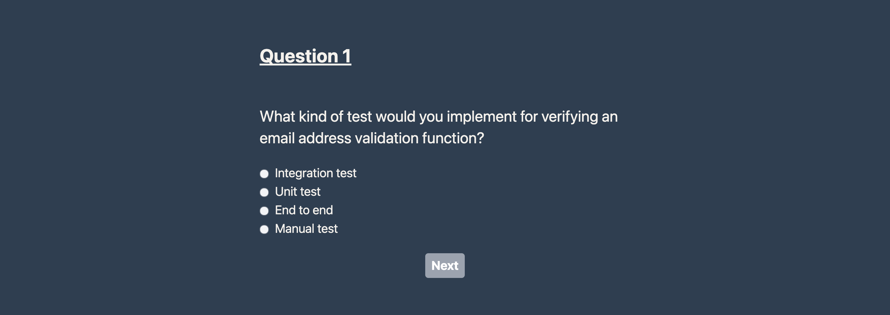

## Instructions
* yarn install
* yarn dev
* open http://localhost:3000
## Additional commands
* yarn cypress:open
* yarn cypress:run
* yarn lint
## Steps
* [Step 1](https://github.com/jonnygamba/simple-web-quizz-application/pull/1)
* [Step 2](https://github.com/jonnygamba/simple-web-quizz-application/pull/2)
* [Step 3](https://github.com/jonnygamba/simple-web-quizz-application/pull/3)
* [Step 4](https://github.com/jonnygamba/simple-web-quizz-application/pull/4)
* [Step 5](https://github.com/jonnygamba/simple-web-quizz-application/pull/5)
* [Step 6](https://github.com/jonnygamba/simple-web-quizz-application/pull/6)
* [Step 7](https://github.com/jonnygamba/simple-web-quizz-application/pull/7)
* [Step 8](https://github.com/jonnygamba/simple-web-quizz-application/pull/8)

---

